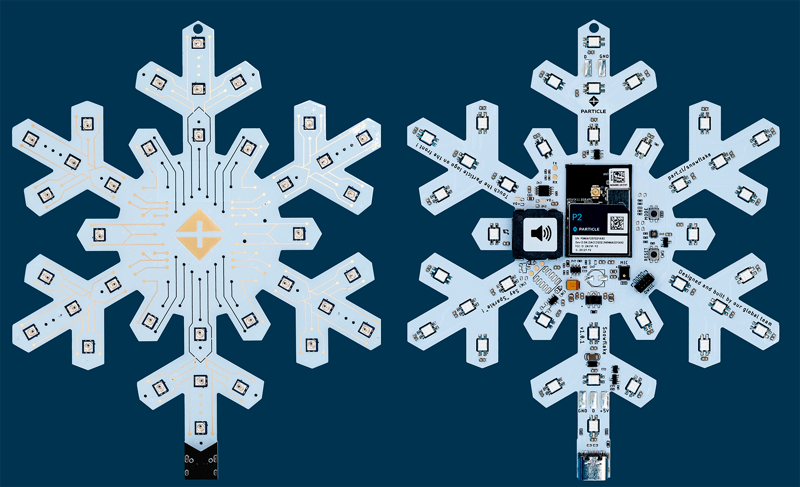

# Particle Snowflake

Welcome to the repository for the Particle Snowflake
, a limited edition [Particle P2](https://store.particle.io/products/p2-wi-fi-module-cut-tape-x10) powered PCBA in the form of a snowflake. The Snowflake provides a seasonal light show and plays a classic holiday tune.

This repository contains all of the firmware and hardware assets required to build the Particle Snowflake.

## Features

The Particle Snowflake has the following components to provide a complete experience straight out of the box:

- 36 individually addressable RGB LEDs to create various colors, patterns, and effects
- Onboard speaker to play festive tunes
- PDM microphone to enable additional features

## Repository Contents

This repository consists of a firmware folder, a hardware folder, and an assets folder.

### Firmware Folder

The firmware folder contains the source code and MP3 asset files that drive the operation of the Particle Snowflake. These include:

- Source code for the application firmware
- Various libraries to support the LEDs, audio and MP3 playback, capacitive touch button drivers, etc.
- MP3 asset files with preloaded message and holiday song

### Hardware Folder

The hardware folder contains detailed design files that can be used for manufacturing the Particle Snowflake. These include:

- Schematic files for the PCBA
- BRD files for the PCBA
- [A comprehensive Bill of Materials (BOM)](./hardware/schematic-pcb/snowflake-hw-v1.0.1/snowflake v1.01 Bom .xlsx)
- Illustrator files for the silkscreen artwork

### Asset Folder

The asset folder contains images and a video illustrating various aspects of the Particle Snowflake. These include:

- [Front of PCBA](./media/Snowflake_Front_Midnight.png)
- [Back of PCBA](./media/Snowflake_Back_Midnight.png)
- [Video of the various light patterns](./media/Snowflake_Action.mp4)

## Usage

Feel free to use these designs as a reference for creating your own Particle Snowflake or use them directly in your designs. 

## Contributing

As an open-source project, we encourage contributions and suggestions. If you have an idea for an improvement or notice a bug, please open an issue or submit a pull request.

## License

This project is open source and available under the [Apache License 2.0](LICENSE).
